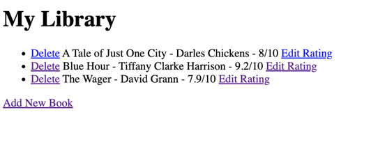
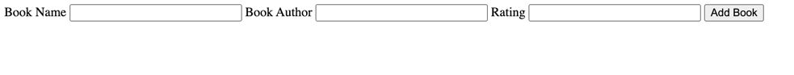
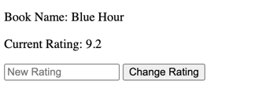

### Installation
1. Create a directory on your machine to house the project. Something like "DigitalLibrary" should work fine.
```commandline
mkdir DigitalLibrary
```
2. On this page, look above and select "Code"
3. From there, copy HTTPS web URL
4. Return to you terminal and clone the repo to your machine.
```commandline
git clone https://github.com/LanoCodes/Digital-Library.git
```
5. Using your IDE (I used PyCharm), open the DigitalLibrary project.
6. Run main

### Usage & Thoughts
- You will notice that there's already existing .db file created. This is just for example purposes.
  - You can start by simply deleting that file and after running main, the necessary .db file will be created for you.

- Snapshots of what the project looks like when running is attached below.
- 
- 
- 

- You will also notice that there\'s a SECRET_KEY at the top of main.py that's been included with this project.
  - This is for demo purposes only and doesn't reflect best practices. Please change that as you see fit!

Thank you!
